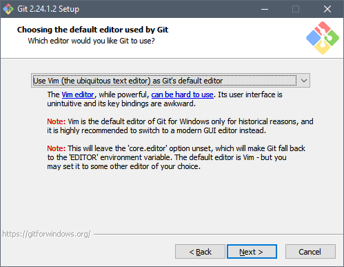
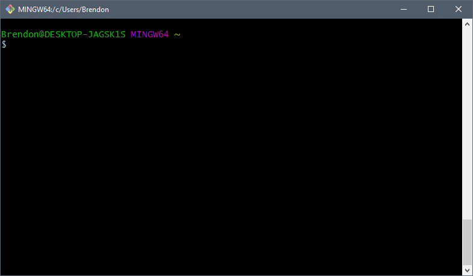
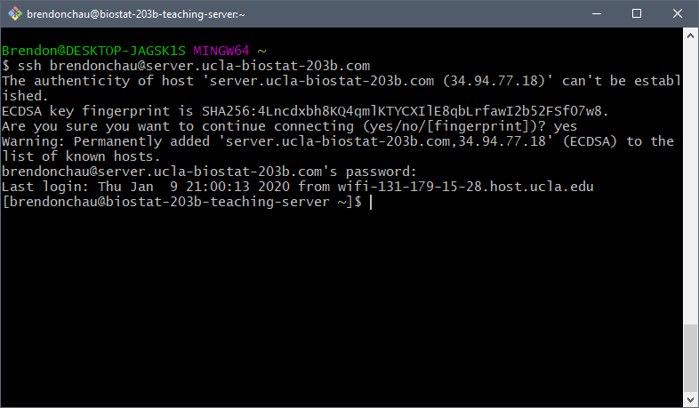
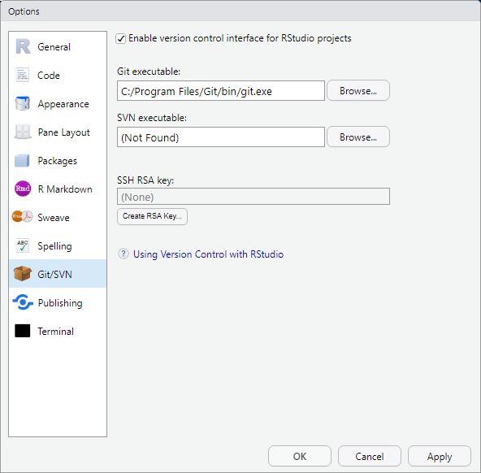

```{r setup, include=FALSE}
knitr::opts_chunk$set(echo = FALSE, eval = FALSE, fig.align = 'center')
```

This tutorial is based on a previous note by Brendon Chau.

## Introduction to Git for Windows

For Biostat 203B, a *hard* requirement is knowing how to work with version control using `git`, specifically using `git` over `SSH`. Ordinarily, this requires the installation of a `git` client on Windows (i.e. [`Git for Windows`](https://git-scm.com/download/win)) and then having to manage `SSH` keys on Windows using an external keygen. It turns out that `Git for Windows` ships with the `MinGW64` toolchain, which *completely avoids the issue of an external keygen*. This can be accessed by running `Git Bash` once `Git for Windows` is installed. The advantage of this is that `RStudio` on Windows supports and is integrated `Git for Windows`, making it easy to do version control. This tutorial will be a how to in ~~excessive~~ detail.

## Installation Instructions

### Downloading and Running the `Git for Windows` Binary Installer

Simply navigate to [`Git for Windows`](https://git-scm.com/download/win) and download the appropriate version (for most of you, it will be **64-bit Git for Windows Setup**).

#### Choosing the default editor used by Git

Go through the installation instructions as you would any other program, until you hit **choosing the default editor used by Git**.

```{r editor, echo = FALSE, eval =TRUE, out.width='60%'}

```

Make sure you know [basic `vim` commands](https://www.fusionbox.com/blog/detail/vim-survival-guide/609/), if you choose `vim`, or you can choose Notepad++.

#### Adjusting your PATH environment

Make sure to select the **Git from the command line and also 3rd-party software**, if this is not selected, RStudio **will not find Git**.

#### Choosing HTTPS transport backend

Leave the default option of **Use the OpenSSL library**.

#### Configuring the line-ending conversions

For historical reasons, Windows and Linux encode line-breaks differently, this occasionally causes problems for people unfamiliar. Choose the default option of **Checkout Windows-style, commit Unix-style line endings**.

#### Configuring the terminal editor to use with Git Bash

This option doesn't matter, leave the default option **Use MinTTY**

#### Configuring extra options

Leave these unchanged.

#### Configuring experimental options

Leave the default option (unselected).

After configuring all of the options, continue with installation.

### Using `Git Bash`

Conveniently, `Git Bash` ships with all of the tools needed for Biostat 203B (`grep`, `awk`, `sed` and `ssh`). For the text processing, the command are identical to lecture. For completeness sake, I will review SSH using `Git Bash`.

#### Setting up SSH keys in `Git Bash`

Open a `Git Bash` terminal to get to window like this:

```{r bash_terminal, echo = FALSE, eval =TRUE, out.width='60%'}

```

We want to test whether or not we can SSH into the server, so simply run the command:

```{bash, eval = FALSE, echo = TRUE}
ssh USERNAME@server.ucla-biostat-203b.com
```

You'll have a prompt about adding the server to the list of known hosts, pass `yes`. Then, you should have a prompt for password, which is just your server password.

```{r test ssh, echo = FALSE, eval = TRUE, out.width='60%'}

```

Now that we've confirmed that SSH works in `Git Bash`, the remaining instructions are identical to the rest of lecture instructions for SSH, so we will omit them.

### Configure `Rstudio` to use `Git for Windows`

So long as you've installed to the default installation path, `Git for Windows` should be automatically detected by `Rstudio`.

If not, go ahead and go to `Tools > Global options...`and select the **Git/SVN** tab. If its configured correctly, it should look like this:

```{r Git for R, echo = FALSE, eval = TRUE, out.width='60%'}

```

If it isn't configured, you should point to the `Git executable` to wherever you've installed `Git` on your PC.
